# Differentiable and Learnable MPC: A Survey

> A living survey and curated bibliography of differentiable, learnable,
> and reinforcement-learning-enhanced predictive control.

This repository accompanies the survey **Differentiable and Learnable
Model Predictive Control: A Survey** and provides a living catalog of
research at the intersection of Model Predictive Control (MPC),
differentiable optimization, machine learning, and reinforcement learning.

## 🔥 Updates

- **Oct. 2026** — Repository initialized.
- Initial bibliography contains approximately 180 papers on differentiable,
  learnable, and reinforcement-learning-enhanced MPC.
- Introduced a three-group taxonomy based on how learning interacts with
  predictive control.
- Application domains are treated as cross-cutting metadata rather than
  mutually exclusive methodological categories.

## 📃 Introduction

Model Predictive Control provides a principled framework for optimal
decision-making under dynamics and constraints, but its practical
performance depends strongly on the predictive model, objective function,
constraints, solver, and controller parameters. Traditionally, these
components are designed and tuned manually.

Recent advances in differentiable optimization and machine learning make
it possible to learn parts of the MPC formulation directly from data and
closed-loop experience. This has led to several complementary research
directions, including differentiable MPC, differentiable predictive
control, learning-based MPC approximation, reinforcement-learning-based
MPC tuning, and hybrid MPC-RL architectures.

This repository organizes this rapidly growing literature according to
**how learning interacts with the MPC structure**, rather than only by
application domain.

## 🎯 Scope

This survey considers methods in which learning interacts directly with
Model Predictive Control, predictive optimal control, or the optimization
machinery used to construct an MPC policy.

Included topics comprise:

- differentiable MPC and differentiable optimal control;
- implicit differentiation and KKT-based MPC sensitivities;
- differentiable predictive control;
- learning MPC costs, weights, models, constraints, and terminal ingredients;
- reinforcement learning with parameterized MPC policies;
- MPC-guided and MPC-augmented reinforcement learning;
- learning-based approximation and acceleration of MPC;
- safe, robust, and certified learning-based MPC;
- differentiable and learning-based optimization methods directly relevant
  to predictive control.

Application papers are included when learning is a substantive component
of the MPC methodology rather than merely an unrelated module surrounding
a conventional MPC controller.

## 🧭 Taxonomy

We classify the literature according to the primary mechanism through which
learning interacts with predictive control.

### 1. MPC-Structured Differentiable and Learning-Based Policies

Learning is embedded in the MPC or optimization structure itself. Gradients
may propagate through the optimization problem, or a learned component may
replace, approximate, or augment part of the predictive-control formulation.

The group comprises:

1. **Differentiable MPC and Optimization-Based Policies**
2. **Differentiable Predictive Control**
3. **Structured and Learned Predictive Models for MPC**
4. **Learning-Based Approximation and Acceleration of MPC**
5. **Safe, Robust and Certified Learning-Based MPC**

### 2. RL- and Task-Informed MPC: Hybrid Learning and Control

MPC remains a recognizable optimization-based controller, while an outer
learning mechanism tunes, guides, augments, or evaluates the MPC policy
using closed-loop or task-level performance.

The group comprises:

1. **RL for MPC Parameter and Cost Tuning**
2. **RL-Guided and RL-Augmented MPC**
3. **Value Learning, Policy Optimization and MPC-Based RL**
4. **Imitation, Decision-Focused and Task-Oriented MPC Learning**

### 3. Foundations, Tools, Surveys and Perspectives

This group contains the mathematical foundations, learning algorithms,
differentiable optimization techniques, software frameworks, and survey
literature required to understand and implement the methods above.

The group comprises:

1. **Foundations of Reinforcement Learning and Optimal Control**
2. **Differentiable Optimization and Sensitivity Analysis**
3. **Software and Computational Tools**
4. **Surveys, Tutorials and Perspectives**

## 🔀 Classification Flow

To ensure a consistent classification of the literature, each candidate
paper is first assigned to a primary methodological group according to how
learning interacts with the MPC formulation. Additional characteristics,
such as the learned MPC component, learning mechanism, and application
domain, are treated as cross-cutting metadata.

```mermaid
flowchart TD

    A["Candidate paper"]
    S["Explicit connection to MPC,<br/>predictive control, or<br/>optimization-based control?"]
    Q1["Primary contribution embeds learning<br/>in or differentiates through the<br/>MPC / OCP structure?"]
    Q2["Primary contribution uses learning<br/>to tune, guide, augment, or evaluate<br/>an MPC controller?"]
    Q3["Foundational algorithm,<br/>differentiable optimization method, software,<br/>survey, or perspective?"]

    G1["GROUP I<br/>MPC-Structured Differentiable<br/>and Learning-Based Policies"]
    G2["GROUP II<br/>RL- and Task-Informed MPC<br/>Hybrid Learning and Control"]
    G3["GROUP III<br/>Foundations, Tools,<br/>Surveys and Perspectives"]

    OUT["Outside primary scope"]

    META["Add cross-cutting metadata"]
    L["What is learned?<br/>Cost - Dynamics - Constraints<br/>Value - Solver - Policy"]
    M["How is it learned?<br/>RL - Implicit differentiation<br/>Imitation - Supervision - etc."]
    APP["Where is it applied?<br/>UAV - Automotive - HVAC<br/>Energy - Process - Robotics - etc."]

    A --> S

    S -->|Yes| Q1
    S -->|No| OUT

    Q1 -->|Yes| G1
    Q1 -->|No| Q2

    Q2 -->|Yes| G2
    Q2 -->|No| Q3

    Q3 -->|Yes| G3
    Q3 -->|No| OUT

    G1 --> META
    G2 --> META
    G3 --> META

    META --> L
    META --> M
    META --> APP

    classDef main fill:#dceefa,stroke:#c4d2dc,stroke-width:1px,color:#0759a5;
    classDef decision fill:#f7fbfe,stroke:#b8d8ee,stroke-width:1px,stroke-dasharray:3 3,color:#0759a5;
    classDef group fill:#dceefa,stroke:#c4d2dc,stroke-width:1px,color:#0759a5;
    classDef metadata fill:#dceefa,stroke:#c4d2dc,stroke-width:1px,color:#0759a5;

    class A,OUT main;
    class S,Q1,Q2,Q3 decision;
    class G1,G2,G3 group;
    class META,L,M,APP metadata;

    linkStyle default stroke:#999999,stroke-width:1px;
```

> **Classification policy:** Each paper is assigned to a single primary methodological category according to its main scientific contribution.
> Because many works combine multiple learning and control paradigms, additional methodological characteristics are retained as secondary labels.
> Application domain, learned MPC component, learning mechanism, system/platform, and safety properties are treated as cross-cutting metadata
> and do not determine the primary classification.

## 📈 Publication Timeline
## 📊 Literature Distribution
## 🏷️ Application Domains
## 🔍 Literature Search Strategy
## 📚 Table of Contents

### I. MPC-Structured Differentiable and Learning-Based Policies
### II. RL- and Task-Informed MPC
### III. Foundations, Tools, Surveys and Perspectives

## 🛠️ Software and Implementations
## 🤝 Contributing
## 📜 License
## 📖 Citation
